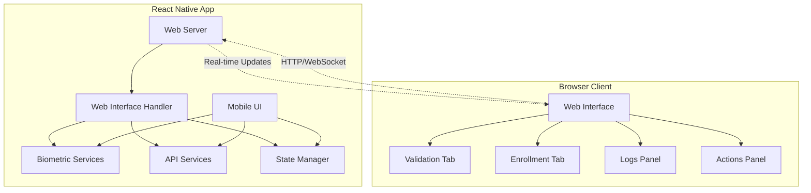

# Design Document

## Overview

The Web Control feature transforms the biometric playground app into a remotely controllable testing platform by embedding an HTTP server that serves a desktop web interface. This design leverages React Native's capabilities to create a local web server while maintaining full integration with existing biometric services and API functionality.

The system architecture follows a client-server pattern where the React Native app acts as both the server (hosting the web interface) and the biometric operations executor, while the web browser serves as a remote control interface.

## Architecture

### High-Level Architecture



### Component Architecture

The web control system integrates with the existing app architecture through these key components:

1. **WebServerService**: Manages HTTP server lifecycle and routing
2. **WebSocketManager**: Handles real-time bidirectional communication
3. **WebControlBridge**: Bridges web requests to existing biometric services
4. **AuthenticationMiddleware**: Implements HTTP Basic Authentication
5. **WebInterfaceRenderer**: Serves the static web interface

## Components and Interfaces

### WebServerService

**Purpose**: Core HTTP server management and request routing

**Key Methods**:
- `startServer(port?: number): Promise<ServerInfo>`
- `stopServer(): Promise<void>`
- `getServerStatus(): ServerStatus`
- `generateAuthCredentials(): AuthCredentials`

**Interfaces**:
```typescript
interface ServerInfo {
  port: number;
  url: string;
  password: string;
  isRunning: boolean;
}

interface AuthCredentials {
  username: string; // Always "admin"
  password: string; // 6-digit random number
}
```

### WebSocketManager

**Purpose**: Real-time communication between web interface and mobile app

**Key Methods**:
- `broadcast(event: string, data: any): void`
- `handleConnection(socket: WebSocket): void`
- `sendToAll(message: WebSocketMessage): void`

**Message Types**:
- `operation-start`: Biometric operation initiated
- `operation-complete`: Operation finished with results
- `log-update`: New log entry added
- `state-sync`: App state synchronization
- `config-update`: Configuration changes

### WebControlBridge

**Purpose**: Adapter between web requests and existing biometric services

**Key Methods**:
- `executeEnrollment(config: EndpointConfig): Promise<OperationResult>`
- `executeValidation(config: EndpointConfig): Promise<OperationResult>`
- `deleteKeys(): Promise<OperationResult>`
- `getAppState(): AppState`
- `updateConfiguration(type: string, config: any): Promise<void>`

**Integration Points**:
- Reuses existing `BiometricService` and `BiometricAPIService`
- Maintains compatibility with current operation logging
- Preserves all existing validation and error handling

### Web Interface Components

**Technology Stack**: Vanilla HTML/CSS/JavaScript (no framework dependencies)

**Core Components**:

1. **TabManager**: Handles validation/enrollment tab switching
2. **EndpointConfigPanel**: Mirrors mobile app configuration options
3. **ActionButtons**: Execute biometric operations
4. **LogsViewer**: Real-time log display with filtering
5. **ResponseViewer**: API response formatting and display

**UI Layout**:
```
┌─────────────────────────────────────────────────────────┐
│ Biometric Playground - Web Control                     │
├─────────────────────────────────────────────────────────┤
│ [Validation] [Enrollment]                    [Clear Logs]│
├─────────────────────────────────────────────────────────┤
│ Endpoint Configuration                                  │
│ ┌─────────────────┐ ┌─────────────────┐                │
│ │ URL             │ │ Method          │                │
│ │ Headers         │ │ Custom Payload  │                │
│ └─────────────────┘ └─────────────────┘                │
├─────────────────────────────────────────────────────────┤
│ [Enroll] [Validate] [Delete Keys]                      │
├─────────────────────────────────────────────────────────┤
│ API Response                                            │
│ ┌─────────────────────────────────────────────────────┐ │
│ │ JSON formatted response data                        │ │
│ └─────────────────────────────────────────────────────┘ │
├─────────────────────────────────────────────────────────┤
│ Logs                                                    │
│ ┌─────────────────────────────────────────────────────┐ │
│ │ Real-time operation logs                            │ │
│ └─────────────────────────────────────────────────────┘ │
└─────────────────────────────────────────────────────────┘
```

## Data Models

### WebControlState

```typescript
interface WebControlState {
  server: {
    isRunning: boolean;
    port: number;
    url: string;
    password: string;
  };
  connections: {
    activeConnections: number;
    lastActivity: Date;
  };
  operations: {
    currentOperation: string | null;
    isLoading: boolean;
    lastResult: OperationResult | null;
  };
}
```

### WebSocketMessage

```typescript
interface WebSocketMessage {
  type: 'operation-start' | 'operation-complete' | 'log-update' | 'state-sync' | 'config-update';
  timestamp: string;
  data: any;
  operationId?: string;
}
```

### WebRequest

```typescript
interface WebRequest {
  action: 'enroll' | 'validate' | 'delete-keys' | 'get-state' | 'update-config';
  payload?: {
    endpointConfig?: EndpointConfig;
    configType?: 'enroll' | 'validate';
    customPayload?: string;
  };
  requestId: string;
}
```

## Error Handling

### Authentication Errors
- **401 Unauthorized**: Invalid or missing credentials
- **403 Forbidden**: Valid credentials but access denied
- **Rate Limiting**: Prevent brute force attacks

### Server Errors
- **Port Conflicts**: Automatic port selection with fallback
- **Network Errors**: Graceful degradation and error reporting
- **Resource Limits**: Connection limits and cleanup

### Operation Errors
- **Biometric Failures**: Preserve existing error handling from BiometricService
- **API Failures**: Maintain compatibility with BiometricAPIService error handling
- **State Synchronization**: Handle disconnections and reconnections

### Error Response Format
```typescript
interface ErrorResponse {
  success: false;
  error: string;
  code: string;
  timestamp: string;
  details?: any;
}
```

## Testing Strategy

### Unit Testing
- **WebServerService**: Server lifecycle, routing, authentication
- **WebSocketManager**: Connection handling, message broadcasting
- **WebControlBridge**: Service integration, operation execution
- **AuthenticationMiddleware**: Credential validation, security

### Integration Testing
- **End-to-End Operations**: Web interface → mobile app → backend API
- **Real-time Communication**: WebSocket message flow and synchronization
- **State Synchronization**: Configuration changes across interfaces
- **Error Scenarios**: Network failures, authentication errors, operation failures

### Manual Testing
- **Cross-browser Compatibility**: Chrome, Firefox, Safari, Edge
- **Network Scenarios**: Different network configurations, firewall settings
- **Concurrent Usage**: Multiple browser sessions, mobile app usage during web control
- **Security Testing**: Authentication bypass attempts, unauthorized access

### Performance Testing
- **Server Load**: Multiple concurrent connections
- **Memory Usage**: Long-running server sessions
- **WebSocket Performance**: High-frequency message broadcasting
- **Mobile App Impact**: Resource usage when server is running

## Security Considerations

### Authentication
- HTTP Basic Authentication with random 6-digit password
- Password regeneration on server restart
- Session timeout and cleanup

### Network Security
- Server binds to 0.0.0.0 but only accepts local network connections
- No HTTPS required for local development use case
- Rate limiting on authentication attempts

### Data Protection
- No sensitive data persistence in web interface
- Biometric data remains within mobile app security boundary
- API responses sanitized before web transmission

### Access Control
- Single user authentication model
- No user management or role-based access
- Server automatically stops when mobile app closes

## Implementation Dependencies

### Required React Native Packages
- **HTTP Server**: Research and select appropriate package (e.g., `react-native-http-server`)
- **WebSocket Support**: Built-in or lightweight WebSocket implementation
- **Network Info**: For IP address detection and network status

### Web Interface Dependencies
- **No External Frameworks**: Pure HTML/CSS/JavaScript for minimal footprint
- **WebSocket Client**: Native browser WebSocket API
- **JSON Formatting**: Built-in JSON.stringify with custom formatting

### Development Dependencies
- **Testing**: Extend existing Jest setup for web server testing
- **Build Process**: No additional build steps required for web interface
- **Debugging**: Leverage existing React Native debugging tools

## Deployment Considerations

### Mobile App Integration
- Web server as optional feature with toggle in settings
- Minimal impact on app size and performance when not in use
- Graceful fallback if server fails to start

### Network Requirements
- Local network access for remote control
- Firewall considerations for development environments
- Port availability and conflict resolution

### Platform Compatibility
- iOS and Android support through React Native
- Desktop browser compatibility (Chrome, Firefox, Safari, Edge)
- No mobile browser support (desktop-only interface)

## Future Extensibility

### Additional Features
- **Configuration Presets**: Save and load endpoint configurations
- **Operation History**: Persistent operation logs and results
- **Batch Operations**: Execute multiple operations in sequence
- **Export Functionality**: Export logs and results to files

### API Enhancements
- **REST API**: Formal REST endpoints for programmatic access
- **Webhook Support**: Outbound notifications for operation completion
- **Plugin Architecture**: Support for custom operation types

### UI Improvements
- **Themes**: Light/dark mode matching mobile app
- **Responsive Design**: Future mobile browser support
- **Advanced Filtering**: Complex log filtering and search
- **Real-time Charts**: Operation performance visualization